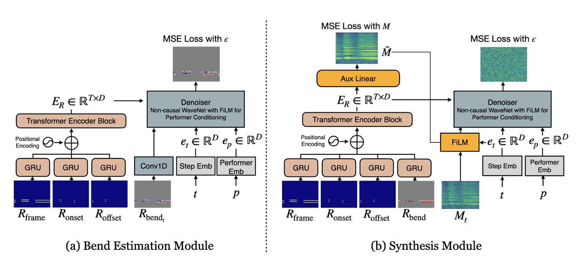

# ViolinDiff
This model is provided for non-commercial, research use only.

Official **PyTorch implementation** of  **"ViolinDiff: Enhancing Expressive Violin Synthesis with Pitch Bend Conditioning"**
**Keywords**: Violin Synthesis, Neural Audio Synthesis, Pitch Bend Modeling, Expressive Performance, Diffusion Models


[](https://arxiv.org/pdf/2409.12477)  [](https://daewoung.github.io/ViolinDiff-Demo/)  [](https://huggingface.co/dawokim/ViolinDiff)

<table>
  <tr>
    <td></td>
   </a></td>
  </tr>
</table>


## Overview

This repository provides the official PyTorch codebase for **ViolinDiff**, a diffusion-based model that focuses on generating expressive violin performances via **pitch bend modeling**. 

ViolinDiff is divided into two main modules:
1. **Bend Module**  
   - Predict the **pitch bend roll** from MIDI.

2. **Synth (Synthesis) Module**  
   - Converts pitch and bend information, along with other performance controls, into the final violin audio signal.  

## Getting Started

### Installation
1. Clone this repository.
   ```bash
   git clone https://github.com/daewoung/ViolinDiff.git
   cd ViolinDiff
   ```

2. Create a new Conda environment.
   ```bash
   conda create -n VD python=3.10
   conda activate VD
   ```

3. Install [PyTorch](https://pytorch.org/get-started/previous-versions) 
  ```bash
  conda install pytorch==2.0.1 torchvision==0.15.2 torchaudio==2.0.2 pytorch-cuda=11.8 -c pytorch -c nvidia
  ```
3. Install other dependencies
  ```bash
  pip install -r requirements.txt
  ```
